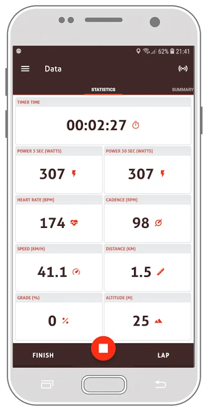

# ESP32 Zephyr CSC BLE bike sensor

Bike Computer application running on an ESP32 microcontroller using the Zephyr RTOS. 
The application utilizes BLE (Bluetooth Low Energy) protocol and 
CSC (Cycling Speed and Cadence) GATT profile to exchange data and commands with client device 
such as phone.

## Building
```
west build -b esp32_devkitc_wroom -- -DOPENOCD="/usr/bin/openocd" -DOPENOCD_DEFAULT_PATH="/usr/share/openocd/scripts" -DBOARD_FLASH_RUNNER= -DBOARD_DEBUG_RUNNER=openocd
```

## Flashing

```
west flash
```

## Debugging

```
openocd -f [path-to-the-zephyr-stack]/boards/xtensa/esp32_devkitc_wroom/support/openocd.cfg
```

```
~/bin/zephyr-sdk-0.16.4/xtensa-espressif_esp32_zephyr-elf/bin/xtensa-espressif_esp32_zephyr-elf-gdb -ex 'target extended-remote localhost:3333' build/zephyr/zephyr.elf
```

## Demonstration

The device was designed to be connected and transmit data to your phone while you're and riding a bike. In order to do this,
you'll have to install application that can visualize this data on your phone. 
I used [Jepster app](https://www.jepster.nl/index.html), which has proven to be simple to setup and use.



## Useful links
- [Bluetooth SIG CSC docs](https://www.bluetooth.com/blog/part-2-the-wheels-on-the-bike-are-bluetooth-smart-bluetooth-smart-bluetooth-smart/)
- [Adafruit CSC showcase](https://learn.adafruit.com/bluetooth-bicycle-speed-cadence-sensor-display-with-clue/cycling-speed-and-cadence-service)
